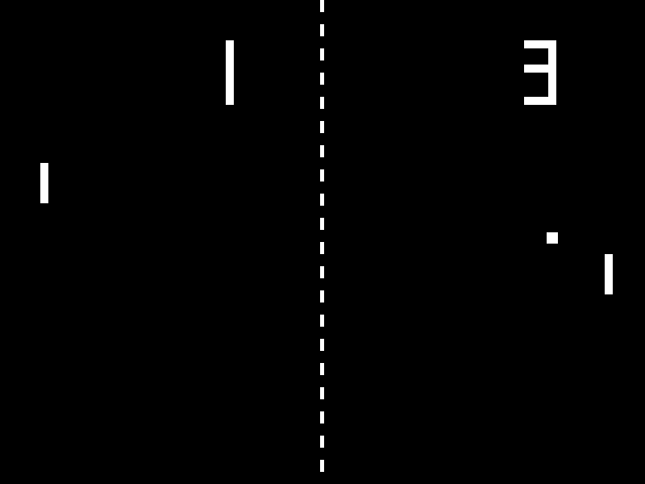

# Tennis

An attempt to recreate the [Pong](https://en.wikipedia.org/wiki/Pong) arcade
game from 1972 with sound in C using only the [SDL](https://www.libsdl.org/)
cross-platform multimedia library.

The window is resizable, desktop fullscreen can be toggled with the keyboard,
gamepad and touch controls are supported, and you can play it natively on
Windows, Linux and macOS or in a web browser
[right now](https://catsocks.github.io/tennis-sdl).

You can watch a video of 1972 Pong on Youtube
[here](https://www.youtube.com/watch?v=fiShX2pTz9A).

## Screenshot

## Controls

### Keyboard

* <kbd>W</kbd> and <kbd>S</kbd> moves the paddle on the left up and down
* <kbd>↑</kbd> and <kbd>↓</kbd> moves the paddle on the right up and down
* <kbd>R</kbd> restarts the round
* <kbd>M</kbd> toggles sound
* <kbd>P</kbd> toggles pause
* <kbd>F11</kbd> toggles fullscreen

### Gamepad

* _D-pad up_ and _D-pad down_ moves a paddle up and down

### Touch

* Tap either side of the screen to **move a paddle**.
* Double tap on the middle of the screen to **toggle fullscreen**.

## Build

You can build the project using either [CMake](https://cmake.org/) or by simply
running build.sh on an Unix-like system.

The only build requirements for a native build are the SDL library version 2 and
a C compiler with support for C99. I have only built this project on Linux but
it should be buildable on Windows and macOS as it is or with very minor changes.

For a WebAssembly build you only need to additionally install
[Emscripten](https://emscripten.org/index.html) and you can build using CMake
with the help of the _emcmake_ tool or by running build-wasm.sh.

To build for Windows using MinGW it's helpful to use _mingw64-cmake_ or
_mingw32-cmake_ in place of the default CMake executable.

## License

Everything with the exception of the files mentioned in
[THIRD_PARTY_NOTICES.md](THIRD_PARTY_NOTICES.md) is dedicated to the public
domain under the CC0 1.0 Universal license included in the LICENSE.md file.

## Acknowledgements

* ['Fork me on GitHub' SVG ribbons](https://github.com/Usecue/fork-me-on-github-svg-ribbons)
